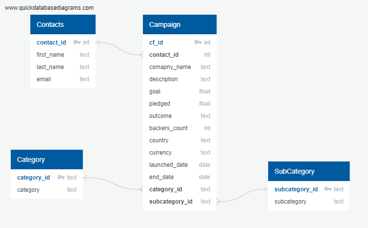

# Module 13 Project 2 - ETL - Extract Transform and Load
## Project Description
In this project we practice building an ETL pipeline using Python, Pandas, and used Python dictionary and RegEx methods to extract and transform the data. After transforming the data, we created four CSV files and used the CSV file data to create an ERD and a table schema. Finally, we uploaded the CSV file data into a Postgres database.

## Contributors
- Nidhi Ojha

### Instructions
- The instructions for this mini project are divided into the following subsections:
   - Create the Category and Subcategory DataFrames
   - Create the Campaign DataFrame
   - Create the Contacts DataFrame
   - Create the Crowdfunding Database
- The csv files are located in the Resources folder under the Crowdfunding_ETL project folder
- output folder contains ERD, SELECT query results images, and sql queries for the DB and schema creation for the crowdfunding_db database.

### Data Modeling using ERD (Entity Relationship Diagram)
- Below ERD is created using <a href="https://www.quickdatabasediagrams.com/" target="_blank">QuickDBD</a>. 
- This illustrates relationship between the four dataset we created above.
- The ERD is located under "Crowdfunding_ETL/output/QuickDBD-export-crowdfunding_db.png"

### How to execute the code
1. Run the Jupyter Notebook to extract, transform data, and create CSV files. These CSV files are located under ./Resources folder
2. To create Postgress DB named crowdfunding_db database, run "crowdfunding_db_creation.sql" located under ./output folder. Please note DB creation is done in a separate script file as Postgress doesn't allow creation of DB under transaction block and hence cannot be clubbed with scripts containing SELECT statements.
3. Use the provided "crowdfunding_db_schema.sql" under ./output folder to create tables in the PostgreSQL database. Please ensure order of schema creation is not changed. The order should be as below:
   - contacts.csv
   - category.csv
   - subcategory.csv
   - campaign.csv
4. Load the CSV files located under ./Resources folder into the corresponding PostgreSQL tables.
5. Query the database to verify the data has been loaded correctly. Script "SELECT-queries.sql" located under ./Resources could be used for querying the populated tables.

